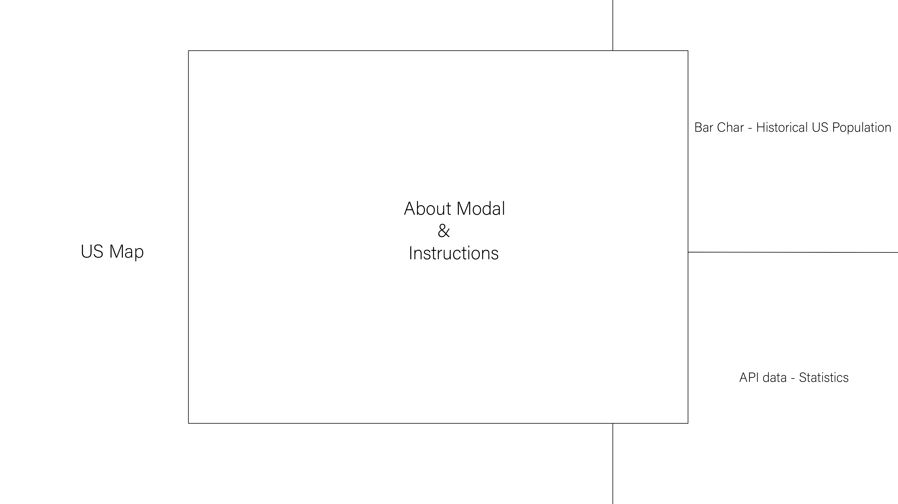
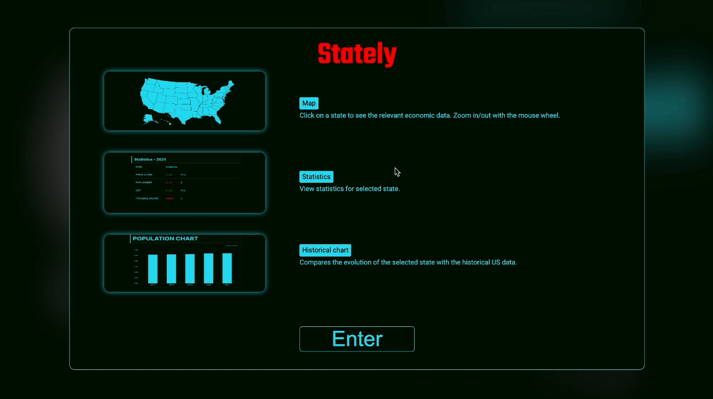
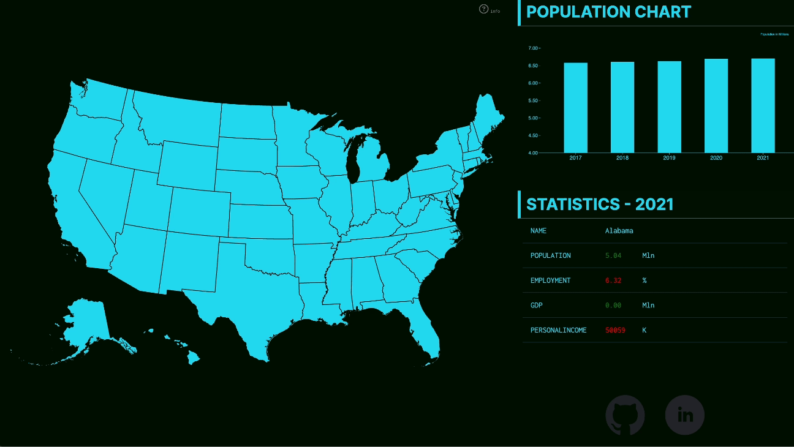

# State Data Visualization
&emsp;

State Data Visualization (SDV) is a tool for visualizing economic and demographic statistics of the United States. For each state, it displays GDP, population, area (in sq mi), unemployment rate, and more. SDV presents the user with a map of the United States. Upon selecting a specific state, the tool fetches that state's unique data from various sources. After fetching the data, it dynamically renders the information, highlighting and zooming into the chosen state on the map

&emsp;
## Main Wireframe

&emsp;
## Functionality and MVPs
In **SDV**, users will be able to:
1. Click on the map to select the state.
2. Zoom in/out a map.
3. Detailed view of statistics for the selected state.
4. Historical bar chart for specific statistics (For example, US Population).

&emsp;
## Technologies & Libraries
* HTML, CSS, Vanilla Javascript, D3, Webpack

&emsp;
## Modal/Info window
The Modal is a customizable and accessible overlay component designed to display concise instructions and highlight the core functionalities. It serves as an immediate point of reference for users to understand the functionality and navigate in the app.

&emsp;
## Map
Users can click on any state on the map, and relevant economic/demographic data will be displayed for the selected US state. **Stately** fetches publicly available data from the following sources:

- [U.S. Bureau of Economic Analysis (BEA)](https://www.bea.gov/)
- [United States Census Bureau](https://www.census.gov/data/developers/data-sets.html)

&emsp;

## Implementation Timeline:
* **Friday Afternoon & Weekend:**
 Setup project, including getting webpack up and running. Create map, state, classes and ensure that my data is being fetched properly. Get zoom in and zoom out functionality.

* **Monday:** Build UI skeleton and create theme based on bauhaus principles.

* **Tuesday:** Implement index chart with historical index chart for each category (unemployment, GDP per capita etc.)

* **Wednesday:** TBD...

* **Thursday:** Deploy to GitHub pages.
